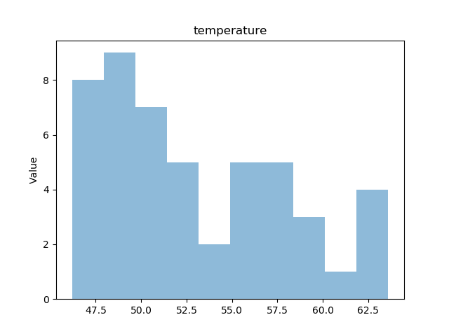
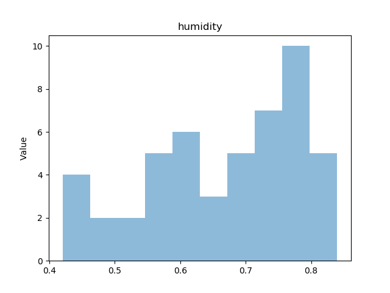
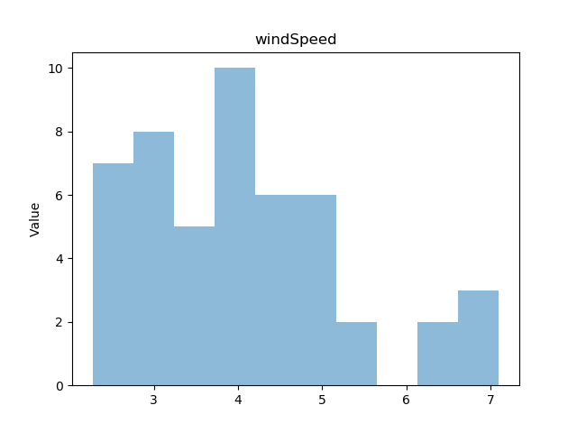
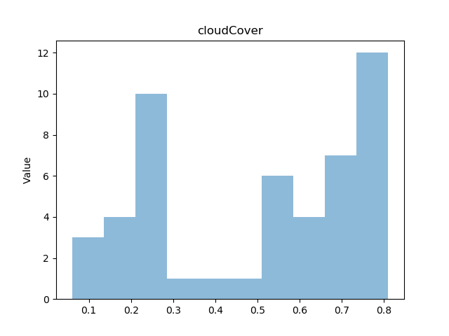
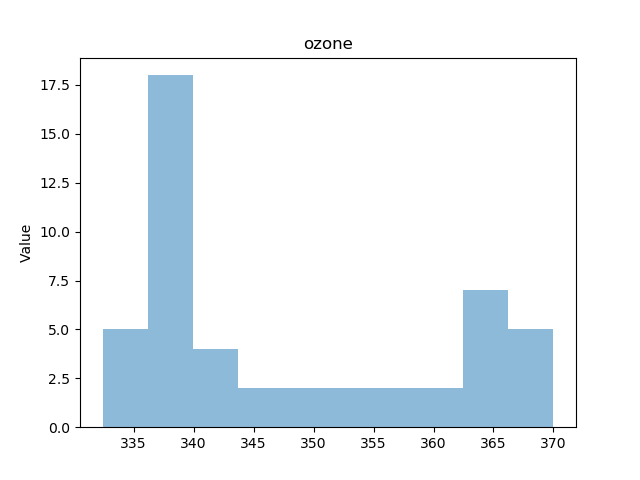
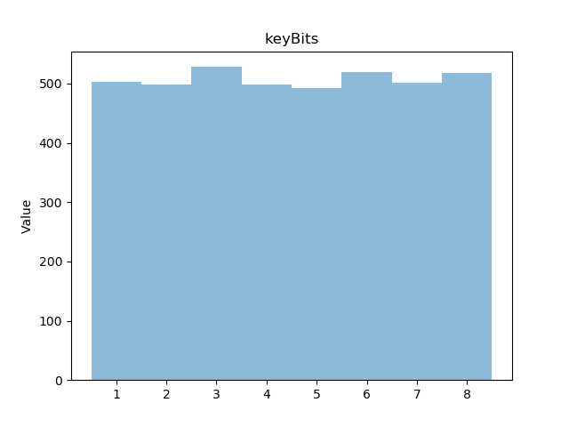
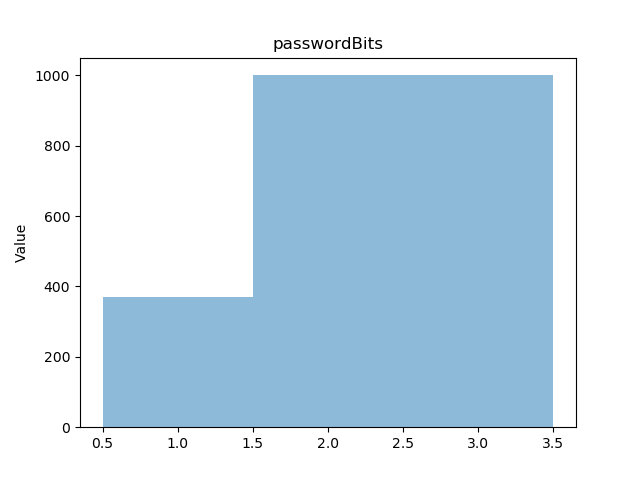
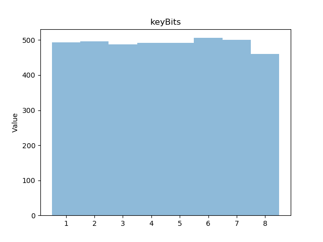

# Key Derivation Function

## HKDF

На основе файла [weather.json](https://github.com/CryptoCourse/hkdf-Tecatech/tree/main/data/weather.json) построены гистограммы температуры, влажности, скорости ветра, облачности и озонового слоя. "Толщина" столбца гистограммы выбрана таким образом, чтобы было наглядно неравномерное распределение величин. В качестве ключевого материала выбрана величина температуры.







```
50.78, 49.93, 49.61, 49.13, 48.59, 48.1, 47.27, 46.5, 46.19, 47.12, 48.78, 50.17, 51.94, 54.27, 55.96, 58.08, 59.5, 59.69, 58.03, 55.31, 53.09, 52.05, 51.43, 50.95, 50.39, 49.96, 49.6, 49.14, 48.73, 48.07, 47.31, 46.47, 46.61, 47.8, 49.71, 51.76, 54.63, 57.87, 60.75, 62.53, 63.6, 63.55, 62.24, 59.63, 57.64, 56.72, 56.26, 55.88, 55.4
0.68, 0.71, 0.73, 0.76, 0.79, 0.81, 0.83, 0.84, 0.84, 0.83, 0.78, 0.74, 0.7, 0.63, 0.58, 0.55, 0.53, 0.53, 0.57, 0.64, 0.7, 0.73, 0.75, 0.76, 0.76, 0.75, 0.75, 0.75, 0.76, 0.78, 0.78, 0.79, 0.76, 0.7, 0.65, 0.6, 0.55, 0.5, 0.46, 0.43, 0.42, 0.43, 0.48, 0.55, 0.59, 0.6, 0.6, 0.59, 0.59
4.55, 4.48, 4.36, 4.36, 4, 3.92, 3.78, 3.52, 3.27, 3.08, 2.98, 3.36, 3.35, 3, 2.31, 2.97, 4.05, 4.82, 5.04, 4.99, 4.73, 4.11, 3.23, 2.56, 2.3, 2.27, 2.35, 2.48, 2.7, 3.13, 3.88, 4.8, 5.6, 6.25, 6.83, 7.1, 6.83, 6.2, 5.57, 4.97, 4.37, 3.96, 3.96, 4.18, 4.27, 4, 3.58, 3.22, 3.04
0.06, 0.1, 0.12, 0.14, 0.15, 0.17, 0.2, 0.23, 0.25, 0.25, 0.25, 0.25, 0.24, 0.22, 0.29, 0.27, 0.24, 0.24, 0.39, 0.6, 0.73, 0.69, 0.57, 0.5, 0.53, 0.61, 0.67, 0.72, 0.77, 0.8, 0.81, 0.81, 0.8, 0.78, 0.77, 0.74, 0.69, 0.63, 0.58, 0.58, 0.58, 0.58, 0.65, 0.74, 0.8, 0.79, 0.74, 0.7, 0.69
339.7, 339, 338, 336.1, 333.7, 332.4, 333.2, 335, 336.8, 338, 339, 339.6, 339.4, 338.9, 338.6, 339.1, 339.9, 340.5, 340.3, 339.8, 339.3, 339, 338.7, 338.8, 339.7, 340.9, 342.4, 344, 345.8, 347.7, 349.7, 351.9, 353.9, 355.6, 357.2, 358.9, 360.8, 362.8, 364.1, 364, 363.3, 363.1, 364.2, 365.7, 366.9, 367.2, 367.2, 367.9, 370
```

На основе хэш-функции SHA-256 реализован [HMAC](https://en.wikipedia.org/wiki/HMAC). В качестве SHA-256 использована криптографически стойкая реализацию из библиотеки `hashlib` на языке `python`.

```python3
def HmacSha256(key, data):
    outer = hashlib.sha256()
    inner = hashlib.sha256()
    
    key = key.ljust(inner.block_size, b'\0')
    outer.update(key.translate(trans_5C))
    inner.update(key.translate(trans_36))
    
    inner.update(data)
    outer.update(inner.digest())
    return outer.digest()
```

Реализована функция `HkdfExtract`, которая на основе псевдослучайной функции `HMAC`, соли `XTS` и ключевого материала `SKM` получает ключ `PRK` для псевдослучайной функции.

```python3
def HkdfExtract(XTS, SKM):
    return HmacSha256(XTS, SKM)
```

Реализована функция `HkdfExpand`, которая на основе псевдослучайной функции `HMAC`, ее ключа `PRK`, контекста `CTX`, прошлого ключа `lastKey` и счетчика `i` получает i-й симметричный ключ.

```python3
def HkdfExpand(PRK, lastKey, CTX, i):
    if lastKey is None:
        lastKey = b''
    return HmacSha256(PRK, lastKey + CTX + i)
```

На основе HKDF для i = 1...1000 получено 1000 симметричных ключей длины 256 бит. В качестве соли использована случайная равномерно распределенная величина, полученная с применением криптографического Г(П)СЧ.

```python3
def hkdf_check():
    data = [50.78, 49.93, 49.61, 49.13, 48.59, 48.1, 47.27, 46.5, 46.19, 47.12, 48.78, 50.17, 51.94, 54.27, 55.96,
            58.08, 59.5, 59.69, 58.03, 55.31, 53.09, 52.05, 51.43, 50.95, 50.39, 49.96, 49.6, 49.14, 48.73, 48.07,
            47.31, 46.47, 46.61, 47.8, 49.71, 51.76, 54.63, 57.87, 60.75, 62.53, 63.6, 63.55, 62.24, 59.63, 57.64,
            56.72, 56.26, 55.88, 55.4]
    XTS = get_random_bytes(32)
    SKM = bytes()
    for x in data:
        SKM += struct.pack("f", x)
    
    PRK = HkdfExtract(XTS, SKM)
    lastKey = None
    CTX = b'Dimarik'
    keys = []
    for i in range(1001):
        lastKey = HkdfExpand(PRK, lastKey, CTX, int_to_bytes(i))
        keys.append(lastKey)
```

Построена гистограмма, подтверждающая равномерную распределенность первых 10 бит ключей.



## PBKDF2

На основе файла [passwords.json](https://github.com/CryptoCourse/hkdf-Tecatech/tree/main/data/passwords.json) построена гистограмма распределения первых 5 бит паролей.



Реализован `PBKDF2` с использованием `HMAC` в качестве `PRF`.

```python3
def pbkdf2_function(key, XTS, count, i):
    r = u = HmacSha256(key, XTS + struct.pack(">i", i))
    for i in range(2, count + 1):
        u = HmacSha256(key, u)
        r = bytes(i ^ j for i, j in zip(r, u))
    return r

def pbkdf2(key, XTS, count = 10000, dk_length = 64):
    dk, h_length = b'', hashlib.sha256().digest_size
    blocks = (dk_length // h_length) + (1 if dk_length % h_length else 0)
    for i in range(1, blocks + 1):
        dk += pbkdf2_function(key, XTS, count, i)
    return dk[:dk_length]
```

Для каждого пароля длины 512 бит получен симметричный ключ.

```python3
def pbkdf2_check():
    with open('data/passwords.json', 'r') as file:
        data = json.loads(file.read())
    
    XTS = get_random_bytes(32)
    keys = []
    for password in data:
        key = password.encode('ascii')
        keys.append(pbkdf2(key, XTS))
    
    with open('data/pbkdf2_keys.txt', 'w') as file:
        for key in keys:
            file.write(key.hex() + '\n')
```

Построена гистограмма, подтверждающая равномерную распределенность первых 10 бит ключей.

